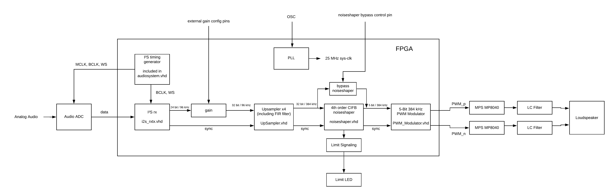

# FPGA based Class-D amplifier (by using a multibit sigma-delta converter / noiseshaper)

I realized a high-res audio PWM modulator on a FPGA with I2S audio input and 384 kHz output PWM signal capable of driving a Mosfet power-stage to build up a Class-D amplifier or an audio-DAC (with RC filter behind the digital pins).  
The whole system runs on a 25 MHz system-clock, the audio-input stream is 96 kHz and the signal is internally upsampled to 384 kHz with an upsampler.  

The signal bit-width is reduced to only 5 bits by a multibit sigma-delta (noiseshaper) structure to feed the 5 Bit / 384 kHz audio signal into a PWM generator.  

The idea behind the project was to explain how fully digital I2S Class-D amps like TI TAS5701 are working internally (by modulating the PWM signal fully digital directly from the incoming data stream - without any additional analog modulators)  

The project is based on a TinyFPGA-BX board (iCE40LP8K from Lattice), a Digilent PMOD I2S2 audio adc/dac board (only ADC used), and a board with two MPS MP8040 power half-bridge drivers to drive the loudspeaker.

Before you start - please read the documentation carefully (Documentation.pdf) to understand how the whole system is working.

Following pinout is used:

PIN24 - ADC-MCLK  
PIN23 - ADC-BCLK  
PIN22 - ADC-LR  
PIN21 - ADC-DATA  
PIN18 - PWM out inverted (PWM_n)  
PIN17 - PWM out normal phase (PWM_P)
PIN16 - gain[0]  
PIN15 - gain[1]  
PIN14 - NoiseShaper Bypass-Control  

Gain = "00" -> Gain = +0dB  
Gain = "01" -> Gain = +3dB  
Gain = "10" -> Gain = +6dB  
Gain = "11" -> Gain = +9 dB  

PIN 14 = "1" -> Noise-Shaper is active  
PIN 14 = "0" -> Noise-Shaper is bypassed

